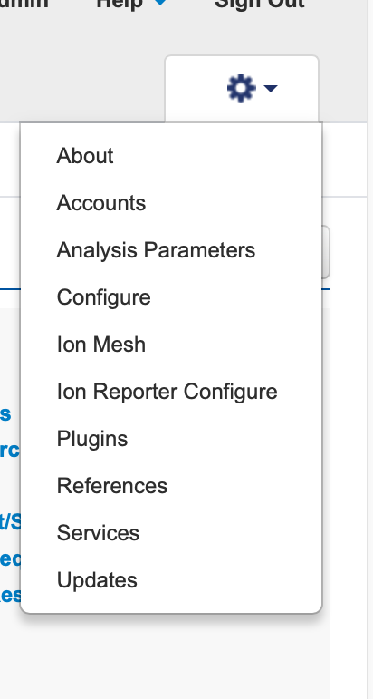
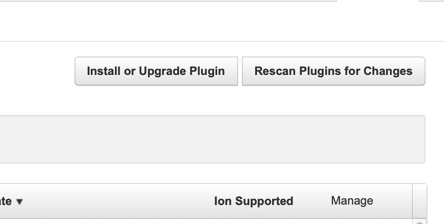

=========================
GUI Installation
=========================

Once you have completed the installation steps listed in the requirements_ next you need to download the zipped folder from the github - https://github.com/NCI-CGR/TypeSeqHPV2

1. Login to the S5 server from a web browser - We have 5 S5s, Professor, Bender, Zapp, Optimusfry and Leela. 

2. Click on the settings tab and select 'Plugins'

3. Click on the 'Install or Upgrade Plugin' 

4. Upload the zip file (remember - if you are uploading this for the second time, you need to change the version number in the launch file. It won't accept a previous version or current version as an update)

.. image:: Third.png

5. Your plugin is now ready and can be launched once you select a project

Zipped folder has 4 files

Launch file 
-------------
  
 Launch file basically has the code to launch the docker run command along with the settings we need to run the docker on the server. The docker tag in the launch file needs to be changed in V2 development branch in the ever of merging to main branch.

 Example launch file

.. code-block:: console
  

   #!/bin/bash
    set -x
    # TypeSeq2 HPV
    VERSION="2.DDMM.YY01"
    #autorundisable
    echo Pipeline version $VERSION

    ln ../../*.bam ./

    docker run -i -v $(pwd):/mnt -v /mnt:/user_files \
      dockerlib:dockertag \
          Rscript /TypeSeqHPV2/workflows/TypeSeq2.R \
          --is_torrent_server yes \
          --config_file config_file.csv \
          --barcode_file barcodes.csv \
          --control_definitions control_defs.csv \
          --grouping_defs grouping_defs.csv \
          --cores 22 \
          --manifest manifest.csv \
          --ram 80G \
          --tvc_cores 4

     rm *rawlib.bam
 

Change the version whenever you are uploading the  zipped folder to the server(second time onwards). S5 servers only take the updated versions once a plugin is installed.  Docker lib is our docker library and docker tag is the tag for the image you are running. For development it is cgrlab/typeseqhpv:development_stable_191226. Config file, barcode file, contorl_defs file and the manifest are input files to be uploaded at launch by the user.

Plan.html and Instance.html
---------------------------

When the user uploads the data, it is stored in the JSON format and is written to the user file directory and processed later by the plugin. The html file interacts with the Apache js server in the background. If you need to change the way HTML input form looks, you can switch both plan and instance. You would need to contact Thermo rep to get more information on this.

Pluginsettings.json
--------------------

This has the plugin run type information 

runtype:
*       "composite"
*       "wholechip"
*       "thumbnail"

Plugin run on thumnails don't generate the whole data. This can be used to test changes. 

